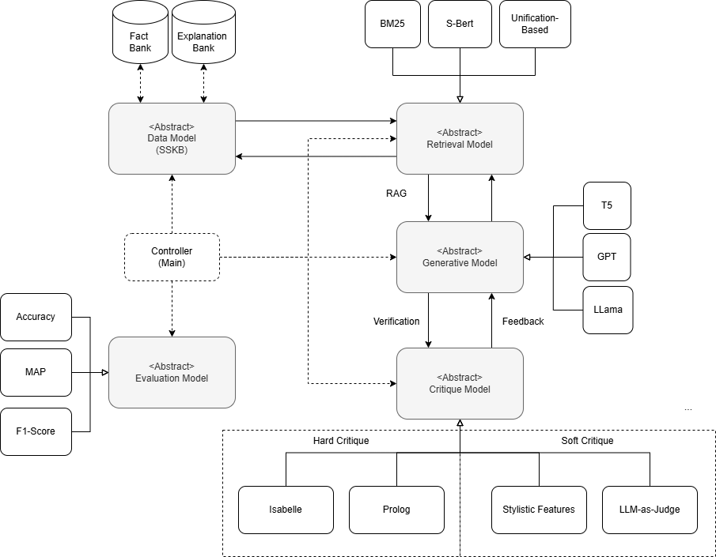

# Reasoning with Natural Language Explanations (Tutorial @ EMNLP 2024)

Explanation constitutes an archetypal feature of human rationality, underpinning learning and generalisation, and representing one of the media supporting scientific discovery and communication. 

Due to the importance of explanations in human reasoning, an increasing amount of research in Natural Language Inference (NLI) has started reconsidering the role that explanations play in learning and inference, attempting to build explanation-based NLI models that can effectively encode and use natural language explanations on downstream tasks.  Research in explanation-based NLI, however, presents specific challenges and opportunities, as explanatory reasoning reflects aspects of both material and formal inference. This type of reasoning demands integrating linguistic, commonsense, and domain-specific knowledge with abstract inferential processes like analogy, deduction, and abduction.

In this tutorial, we provide a comprehensive introduction to the field of explanation-based NLI, grounding this discussion on the epistemological-linguistic foundations of explanations, systematically describing the main architectural trends and evaluation methodologies that can be used to build systems capable of explanatory reasoning.

Tutorial paper:  https://aclanthology.org/2024.emnlp-tutorials.4/

Tutorial website: https://sites.google.com/view/reasoning-with-explanations

## Explanation-Based Neuro-Symbolic Reasoning

In this repository you will find the code for reproducing the demonstrations presented during the tutorial.

High-level overiew of the framework:




## Demonstrations

To integrate the datasets we used a different Python package called SSKB: `pip install sskb`

List of demonstrations:

- Explanation Retrieval and Explanatory Unification Patterns, [link](https://github.com/neuro-symbolic-ai/reasoning_with_nle_emnlp_2024/blob/main/Explanation%20Retrieval.ipynb).
- LLMs-Symbolic Explanation Refinement (with hard critique), [link](https://github.com/neuro-symbolic-ai/reasoning_with_nle_emnlp_2024/blob/main/Neuro-Symbolic%20Explanation%20Refinement.ipynb)
- Inference to the Best Explanation in Large Language Models (with soft critiques), [link](https://github.com/neuro-symbolic-ai/reasoning_with_nle_emnlp_2024/blob/main/Inference%20to%20the%20Best%20Explanation.ipynb)
- Inductive Logic Programming with LLMs, [link](https://github.com/neuro-symbolic-ai/reasoning_with_nle_emnlp_2024/blob/main/Hybrid%20Inductive%20Logic%20Programming.ipynb)


 ## Citation

 If you find this repository useful, please consider citing our tutorial paper.

```
@inproceedings{valentino-freitas-2024-introductory,
    title = "Reasoning with Natural Language Explanations",
    author = "Valentino, Marco  and
      Freitas, Andr{\'e}",
    editor = "Li, Jessy  and
      Liu, Fei",
    booktitle = "Proceedings of the 2024 Conference on Empirical Methods in Natural Language Processing: Tutorial Abstracts",
    month = nov,
    year = "2024",
    address = "Miami, Florida, USA",
    publisher = "Association for Computational Linguistics",
    url = "https://aclanthology.org/2024.emnlp-tutorials.4/",
    doi = "10.18653/v1/2024.emnlp-tutorials.4",
    pages = "25--31",
    abstract = "Explanation constitutes an archetypal feature of human rationality, underpinning learning and generalisation, and representing one of the media supporting scientific discovery and communication. Due to the importance of explanations in human reasoning, an increasing amount of research in Natural Language Inference (NLI) has started reconsidering the role that explanations play in learning and inference, attempting to build explanation-based NLI models that can effectively encode and use natural language explanations on downstream tasks. Research in explanation-based NLI, however, presents specific challenges and opportunities, as explanatory reasoning reflects aspects of both material and formal inference, making it a particularly rich setting to model and deliver complex reasoning. In this tutorial, we provide a comprehensive introduction to the field of explanation-based NLI, grounding this discussion on the epistemological-linguistic foundations of explanations, systematically describing the main architectural trends and evaluation methodologies that can be used to build systems capable of explanatory reasoning."
}
```


